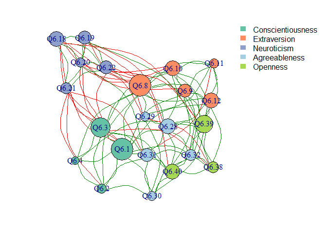

Exploratory Network Analysis on Personality Data
================
Jackson Roatch
5/30/2022

## Introduction

Psychology is undergoing a revolution wherein traditional psychometric
methods are being challenged and new methods, such as network analysis,
are being introduced. Unlike the latent factor model, network analysis
treats psychological variables like traits, beliefs, and attitudes as a
complex system, allowing for a more nuanced web of relationships. See
this recent primer published in Nature for a deeper look at this budding
area of research.

For practitioners, this method can enable new insights, which will be
demonstrated here. In this demonstration, I’m going to show you how to
use network analysis to analyze personality data. I’ve also included the
full data and code at the bottom of the page in case you’d like to
follow along in R.

A network is comprised of nodes and edges (the connections between the
nodes). Using a traditional dataset of self-report big 5 personality
data, we’ll construct a “node” dataframe and an “edge” dataframe,
combining them to create a full network.

### Nodes

For the node dataframe, we’ll simply import an item key from csv and
print it to examine the items:

``` r
node <- read.csv("PersonalityNetworkItems.csv")
node
```

    ##     Item                                  ItemText            Factor
    ## 1   Q6.1                       Am always prepared. Conscientiousness
    ## 2   Q6.2                 Pay attention to details. Conscientiousness
    ## 3   Q6.3                       Carry out my plans. Conscientiousness
    ## 4   Q6.4             Make plans and stick to them. Conscientiousness
    ## 5   Q6.8           Feel comfortable around people.      Extraversion
    ## 6   Q6.9                      Make friends easily.      Extraversion
    ## 7  Q6.10 Am skilled in handling social situations.      Extraversion
    ## 8  Q6.11                 Am the life of the party.      Extraversion
    ## 9  Q6.12             Know how to captivate people.      Extraversion
    ## 10 Q6.18                          Often feel blue.       Neuroticism
    ## 11 Q6.19                           Dislike myself.       Neuroticism
    ## 12 Q6.20               Am often down in the dumps.       Neuroticism
    ## 13 Q6.21                Have frequent mood swings.       Neuroticism
    ## 14 Q6.22                             Panic easily.       Neuroticism
    ## 15 Q6.28            Have a good word for everyone.     Agreeableness
    ## 16 Q6.29 Believe that others have good intentions.     Agreeableness
    ## 17 Q6.30                           Respect others.     Agreeableness
    ## 18 Q6.31                Accept people as they are.     Agreeableness
    ## 19 Q6.32                 Make people feel at ease.     Agreeableness
    ## 20 Q6.38                 Have a vivid imagination.          Openness
    ## 21 Q6.39 Carry the conversation to a higher level.          Openness
    ## 22 Q6.40                  Enjoy hearing new ideas.          Openness

### Edges

The edge file is where things get interesting. When analyzing
psychometric data via network analysis, there are a few ways of
computing edges. The most simple would be to use a correlation matrix,
but this has a few limitations First, many of the correlations may be
spurious, simply reflecting relationships between other related
variables. Second, using a simple correlation matrix to build our
network will create a lot of very weak connections between nodes that
may not neccesarily be meaningful.

A way around these issues is to use a LASSO model, which creates a
penalty, effectively setting small relationships to 0. The following
code applies a LASSO model to our personality data and converts it into
an edge matrix:

``` r
edgecor <- cor(big5, use = "complete.obs")
edgelasso <- EBICglasso(edgecor, n = nrow(big5))
edgelist <- melt(edgelasso)
head(edgelist)
```

    ##   Var1 Var2      value
    ## 1 Q6.1 Q6.1 0.00000000
    ## 2 Q6.2 Q6.1 0.33077597
    ## 3 Q6.3 Q6.1 0.01993257
    ## 4 Q6.4 Q6.1 0.09910999
    ## 5 Q6.8 Q6.1 0.11894720
    ## 6 Q6.9 Q6.1 0.06780809

Some additional data cleaning to remove duplicate edges and create

``` r
edgelist <- edgelist %>%
  select(From = Var1, To = Var2, weight = value) %>%
  filter(weight != 0) %>%
  filter(From != To)

edgelist$sign <- ifelse(edgelist$weight >= 0, "Positive", "Negative")
edgelist$weight <- abs(edgelist$weight)

edgelist <- edgelist %>%
  group_by(From, To) %>%
  mutate(edge_id = paste(sort(unique(c(From, To))), collapse=" ")) 

edgelist<- edgelist[!duplicated(edgelist$edge_id),]
head(edgelist)
```

    ## # A tibble: 6 x 5
    ## # Groups:   From, To [6]
    ##   From  To    weight sign     edge_id   
    ##   <fct> <fct>  <dbl> <chr>    <chr>     
    ## 1 Q6.2  Q6.1  0.331  Positive Q6.1 Q6.2 
    ## 2 Q6.3  Q6.1  0.0199 Positive Q6.1 Q6.3 
    ## 3 Q6.4  Q6.1  0.0991 Positive Q6.1 Q6.4 
    ## 4 Q6.8  Q6.1  0.119  Positive Q6.1 Q6.8 
    ## 5 Q6.9  Q6.1  0.0678 Positive Q6.1 Q6.9 
    ## 6 Q6.12 Q6.1  0.0483 Positive Q6.1 Q6.12

### Creating the Network

From here, we’ll use the igraph package to combine the edge and node
dataframes into a network object. Note, a network is directed if paths
run in a particular direction (such as in a structural equation model).
For our purposes, we’ll set directed to false.

Once the network object is created we can get node-level network
statistics as well.

``` r
net <- graph_from_data_frame(d = edgelist, directed = F, vertices = node)
net <- simplify(net)

V(net)$degree <- igraph::degree(net, mode = "total")
V(net)$clustering <- igraph::transitivity(net, type = "local")
V(net)$betweenness <- igraph::betweenness(net)
V(net)$closeness <- igraph::closeness(net)
```

Now for the fun part - visualizing the network! We’ll run some code to
color our nodes based on what personality factor they align to, and then
we’ll use the igraph package to create a network visualization.

``` r
#color based on factors
V(net)$color[V(net)$Factor == "Conscientiousness"] <- "#66c2a5"
V(net)$color[V(net)$Factor == "Extraversion"] <- "#fc8d62"
V(net)$color[V(net)$Factor == "Neuroticism"] <- "#8da0cb"
V(net)$color[V(net)$Factor == "Agreeableness"] <- "#a6cee3"
V(net)$color[V(net)$Factor == "Openness"] <- "#a6d854"

E(net)$color <- edgelist$sign
E(net)$color <- ifelse(E(net)$color == "Positive", "green4", "red")

par(mar=c(2.1,2.1,2.1,8.1), xpd = T)

set.seed(100)

plot(net,
     layout = layout.fruchterman.reingold,
     vertex.color =  V(net)$color,
     vertex.size =  V(net)$degree^1.3,
     vertex.label = V(net)$Item,
     edge.color = E(net)$color,
     edge.curved = .5,
     edge.width = E(net)$value,
     edge.arrow.size = .08,
     edge.arrow.width = .25
)

legend("topright", 
       bty = "n",
       inset = c(-.3,0),
       legend = c("Conscientiousness", "Extraversion", "Neuroticism", "Agreeableness", "Openness"),
       fill = c("#66c2a5", "#fc8d62", "#8da0cb", "#a6cee3","#a6d854" ), 
       border = NA)
```

<!-- -->

The size of a node reflects the overall strength of connections to that
node.

### Analysis and Interpretation

Looking at the network, we can see that for the most part, our big 5
items clustered into their respective factors. Looking more closely,
examining the network structure allows us to interpret relationships
between the items.

#### Size

1.  Items Q6.1, Q6.3, and Q6.8 are all relatively large, indicating
    influence in the network
2.  Smaller items such as 6.2, 6.4, 6.11 suggest they may be less
    important in the network, although we shouldn’t discount the
    possibility that they are more strongly related to other variables
    not considered here

#### Proximity

1.  The agreeableness item Q6.29, believing that others have good
    intentions, is closely related to extraversion item Q6.8, feeling
    comfortable around others
2.  Openness item Q6.39, “Carry the conversation to a higher level” is
    closely related to two extraversion items, “Am the life of the
    party” and “Know how to captivate people”

#### Position

1.  Looking closely at the network, it seems that the neuroticism items
    have negative relationships with Q6.3 and Q6.8, indicating that
    these items may play a strong role in the neuroticism trait.
2.  Q6.3 and Q6.4 are very similar items, “carry out my plans” and “make
    plans and stick to them”. Because item 6.3 is more central in the
    network and item 6.4 is on the periphery, we might ask whether this
    indicates the redundancy of item 6.4
